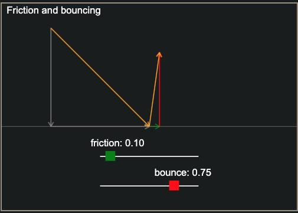

# Título do Seu Projeto

    

## Índice
      
  - [Descrição Inicial](#descrição-inicial)
  - [Título da Seção 1](#título-da-seção-1)
  - [Título da Seção 2](#título-da-seção-2)
  - [Título da Seção 3](#título-da-seção-3)

## Descrição Inicial

Esta é a descrição inicial do seu projeto. Aqui você pode fornecer uma visão geral sobre o que seu projeto faz e por que é importante.

## Título da Seção 1

    

Descrição da Seção 1. Aqui você pode adicionar mais detalhes sobre a primeira seção do seu projeto.

## Título da Seção 2

    

Descrição da Seção 2. Aqui você pode adicionar mais detalhes sobre a segunda seção do seu projeto.

## Título da Seção 3

    

Descrição da Seção 3. Aqui você pode adicionar mais detalhes sobre a terceira seção do seu projeto.
